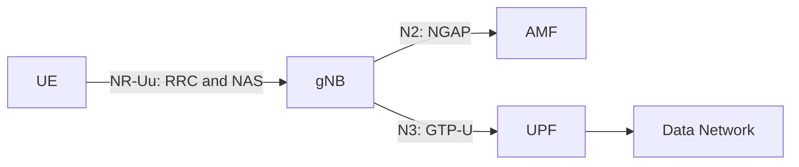
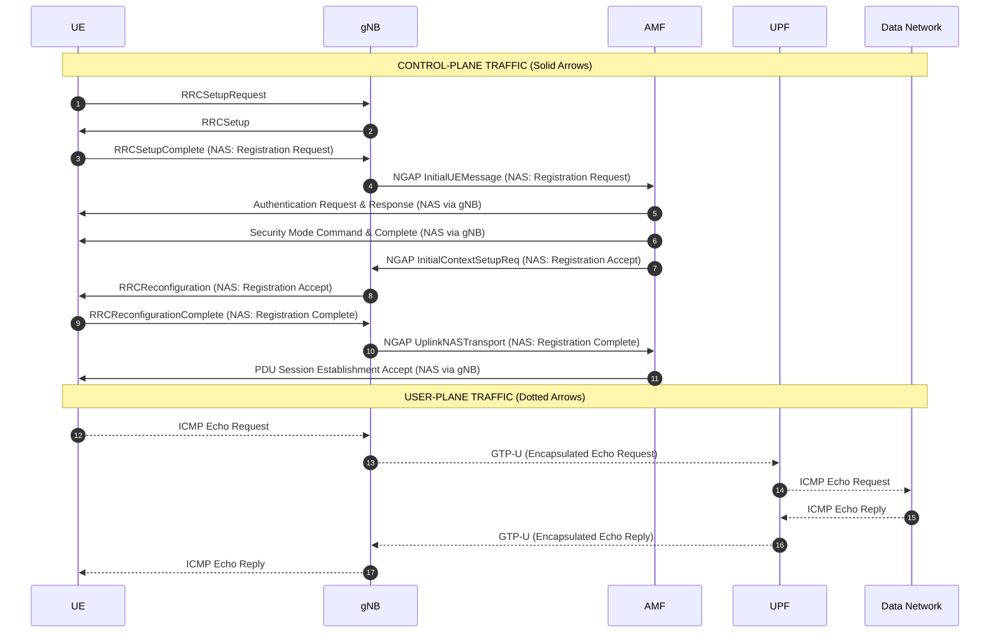

# Lab 1: Analyzing UE–gNB Connectivity in an OAI 5G SA Network(TA)

## 1. Lab Overview

In this lab, you will use Wireshark to analyze how a UE establishes an RRC connection with an OAI gNB and then registers with the 5G Core.

The main signaling path is:

```text
UE
→ RRC connection establishment
→ NAS Registration Request
→ gNB forwards the NAS message through NGAP
→ 5G Registration
→ PDU Session establishment
→ UE obtains an IP address
→ User-plane connectivity test
```

This lab focuses on the relationship between the UE and gNB. Internal 5G Core procedures such as detailed SBI and PFCP signaling are outside the main scope.

### Learning objectives

After completing this lab, you should be able to:

1. Identify the UE, gNB, AMF, UPF, and Data Network.
2. Explain the purpose of `RRCSetupRequest`, `RRCSetup`, and `RRCSetupComplete`.
3. Explain how a NAS message is transported from the UE to the AMF through the gNB.
4. Identify the main 5G Registration messages.
5. Verify that the UE receives an IP address and exchanges user-plane traffic.

## 2. Required Files

You need the following files:

- `OAI-5G-Wireshark-Profile.zip`
- `oai-5g-combined.pcapng`

The capture contains both:

- OAI-generated RAN packets for MAC-NR and NR-RRC analysis
- Core-network packets for NGAP, NAS-5GS, GTP-U, and ICMP analysis

---

## 3. Install the OAI-5G Wireshark Profile

### 3.1 Ubuntu or Linux

Close Wireshark and extract the profile:

```bash
mkdir -p "$HOME/.config/wireshark/profiles"

unzip OAI-5G-Wireshark-Profile.zip \
  -d "$HOME/.config/wireshark/profiles"
```

Verify the profile directory:

```bash
ls "$HOME/.config/wireshark/profiles/OAI-5G"
```

### 3.2 Windows

1. Close Wireshark.
2. Press `Win + R`.
3. Enter `%APPDATA%\Wireshark\profiles`.
4. Create the `profiles` directory if it does not exist.
5. Extract the ZIP file into that directory.

The final directory should look like:

```text
%APPDATA%\Wireshark\profiles\OAI-5G\preferences
%APPDATA%\Wireshark\profiles\OAI-5G\enabled_protos
%APPDATA%\Wireshark\profiles\OAI-5G\disabled_protos
%APPDATA%\Wireshark\profiles\OAI-5G\heuristic_protos
```

Do not add an extra directory level around `OAI-5G`.

## 4. Open and Verify the Capture

1. Start Wireshark.
2. Select `Edit → Configuration Profiles → OAI-5G`.
3. Open `oai-5g-combined.pcapng`.
4. Enter this display filter:

```wireshark
nr-rrc
```

You should see NR RRC messages.

If packets are incorrectly displayed as TP-Link traffic, verify:

```text
Edit → Preferences → Protocols → UDP
→ Enable “Try heuristic sub-dissectors first”

Analyze → Enabled Protocols
→ Enable mac_nr_udp
→ Disable tplink-smarthome
```

> The RAN packets appear as `127.0.0.1:9999 → 127.0.0.1:9999`. These are synthetic packets generated by OAI for Wireshark analysis. They are not the actual network addresses of the UE and gNB.

### Checkpoint 1: Wireshark Setup — 10 points

Submit:

- A screenshot showing that the `OAI-5G` profile is selected. — 3 points
- 
- A screenshot showing the opened capture. — 2 points

- A screenshot showing NR RRC packets after applying `nr-rrc`. — 5 points
- - 

---

## 5. Identify the Basic 5G SA Architecture

Use:

```text
Statistics → Endpoints → IPv4
```

Apply these filters individually:

```wireshark
ngap
```

```wireshark
gtp
```

```wireshark
icmp
```

Complete the table:

| Component | IP address | Evidence from the capture |
|---|---|---|
| UE PDU address | 10.0.0.2|  |
| gNB | 192.168.70.129 |  |
| AMF | 192.168.70.132 |  |
| UPF | 192.168.70.134 |  |
| Data Network | 192.168.70.135 |  |

Complete the interface table:

| Interface | Connected components | Main protocol | Purpose |
|---|---|---|---|
| N1 | UE - AMF | NAS-5GS | Transports core control-plane signaling (Registration, Security, Session Management) between the UE and the 5G Core. |
| N2 | gNB - AMF | NGAP | Transports control-plane signaling between the Radio Access Network (gNB) and the Core (AMF). |
| N3 | gNB - UPF | GTP-U | Tunnels user-plane data traffic between the Radio Access Network and the Core (UPF). |

The logical architecture is:



### Checkpoint 2: Basic Architecture — 10 points

- Correctly identify the five components and their IP addresses. — 5 points
- Correctly explain N1, N2, and N3. — 5 points

---

## 6. Analyze the RRC Connection Establishment

Apply:

```wireshark
nr-rrc
```

Find the following messages in order:

1. `RRCSetupRequest`
2. `RRCSetup`
3. `RRCSetupComplete`

You may also try these specific filters:

```wireshark
nr-rrc.rrcSetupRequest_element
```

```wireshark
nr-rrc.rrcSetup_element
```

```wireshark
nr-rrc.rrcSetupComplete_element
```

Complete the table:

| Message | Direction | Logical channel / SRB | Main purpose | Packet number |
|---|---|---|---|---:|
| RRCSetupRequest | UE $\rightarrow$ gNB | UL-CCCH-Message / SRB0 | To request the establishment of an RRC connection with the gNB. | 104 |
| RRCSetup | gNB $\rightarrow$ UE | DL-CCCH-Message / SRB0 | To configure the RRC connection parameters and establish Signaling Radio Bearer 1 (SRB1). | 105 |
| RRCSetupComplete | UE $\rightarrow$ gNB | UL-DCCH-Message / SRB1 | To confirm successful connection establishment; it is also used to carry the initial NAS message (Registration Request). | 108 |

1. RRC Setup Request (packet 104) 
2. RRC Setup (packet 105) 
3. RRC Setup Complete (packet 108) 

Answer the following questions:

1. What is the establishment cause in `RRCSetupRequest`?
- The establishment cause is mo-Signalling.
2. What SRB does `RRCSetupRequest` use? Why?
- It uses SRB0. This is because a dedicated signaling connection has not been created yet, so the UE must use the common control channel before the connection is established.
3. Which side sends `RRCSetup`?
- The gNB sends the RRCSetup message
4. Which signaling radio bearer is used after the RRC connection is established?
- SRB1 is used after the RRC connection is established.
5. Which NAS message is carried inside `RRCSetupComplete`?
- The Registration Request NAS message is carried inside it.
6. At the end of this procedure, is the UE only connected to the gNB, or is it already registered with the 5G Core? Explain.
- At the end of this specific procedure, the UE is only connected to the gNB. RRCSetupComplete finalizes the radio signaling connection between the UE and the base station, but it merely carries the initial Registration Request destined for the AMF. Establishing the RRC connection does not mean the 5G Core network registration is complete.

### Checkpoint 3: RRC Connection Establishment — 35 points
- Identify all three RRC messages with packet numbers and screenshots. — 12 points
- Correctly identify message directions. — 6 points
- Correctly identify UL-CCCH, DL-CCCH, SRB0, and SRB1 usage. — 7 points
- Explain the purpose of each message. — 6 points
- Explain the difference between RRC connection and 5G Registration. — 4 points

---

## 7. Connect RRC Signaling to NGAP and NAS

The UE exchanges NAS signaling with the AMF through the gNB. On the radio side, the NAS message is carried by RRC. The gNB then forwards it to the AMF through NGAP.

First, locate `RRCSetupComplete` using:

```wireshark
nr-rrc
```

Expand:

```text
RRCSetupComplete
→ dedicatedNAS-Message
→ Registration Request
```

Then apply:

```wireshark
```

Locate:

```text
InitialUEMessage
→ NAS-PDU
→ Registration Request
```

Compare the two packets:

| Stage | Protocol message | Sender → receiver | Encapsulated information |
|---|---|---|---|
| Radio side | RRCSetupComplete | UE $\rightarrow$ gNB | NAS Registration Request |
| Core side | NGAP InitialUEMessage | gNB $\rightarrow$ AMF | NAS Registration Request |

1. RRCSetupComplete :

2. NGAP InitialUEMessage :


Finally, locate:

- Registration Accept : Packet 131
- Registration Complete : Packet 151

Answer:

1. What is the role of the gNB when it transports NAS messages?
- The gNB acts as a transparent relay. It extracts the NAS message from the radio connection (RRC) and forwards it directly to the AMF over the wired connection (NGAP) without processing the NAS contents itself.
2. What is the difference between RRC and NAS signaling?
- RRC (Radio Resource Control) is used exclusively for establishing and managing the radio connection between the UE and the gNB. NAS (Non-Access Stratum) is used for signaling between the UE and the AMF (Core Network) for tasks like registration, authentication, and session management.
3. Is the Registration Request delivered directly from the UE to the AMF? Explain the protocol path.
- No, it is not direct. It requires two transport messages. The UE encapsulates the Registration Request inside an RRCSetupComplete message and sends it to the gNB. The gNB then extracts it and encapsulates it inside an NGAP InitialUEMessage to send to the AMF.
4. Which message confirms that Registration has completed successfully?
- The Registration Complete message confirms the process is finished (the UE sends this to acknowledge the Registration Accept message it received from the AMF).

### Checkpoint 4: RRC-to-NGAP/NAS Mapping — 25 points

- Show the Registration Request inside `RRCSetupComplete`. — 6 points
- Show the Registration Request inside NGAP `InitialUEMessage`. — 6 points
- Correctly complete the mapping table. — 5 points
- Explain the roles of RRC, NGAP, NAS, gNB, and AMF. — 5 points
- Identify Registration Accept and Registration Complete. — 3 points

---

## 8. Verify the UE IP Address and User-Plane Traffic

Apply:

```wireshark
nas-5gs || ngap
```

Find the PDU Session Establishment Accept and record the UE address:

| Field | Observed value |
|---|---|
| UE IPv4 address | 10.0.0.2 |

Apply:

```wireshark
gtp || icmp
```

Find one ICMP Echo Request and its Echo Reply. Confirm that the UE's IP packet is carried inside GTP-U between the gNB and UPF.

Answer:


1. What IPv4 address was assigned to the UE?
- 10.0.0.2
2. How many ICMP Echo Request/Reply pairs are present?
- There is 10 pairs of ICMP Echo Request/Reply. Each ping generate 4 lines : 
- 
3. What does the successful Echo Reply prove about the UE connection?
- A successful Echo Reply proves that the UE has successfully established a PDU session and has a fully functional user-plane connection (via the GTP-U tunnel) to transmit IP data. It definitively confirms end-to-end IP reachability between the UE and the external Data Network.

### Checkpoint 5: UE IP and User Plane — 15 points

- Identify the UE IPv4 address in the PDU Session Establishment Accept. — 6 points
- Show one ICMP Echo Request and its Echo Reply. — 5 points
- Explain what the successful ping proves. — 4 points

---

## 9. Final UE Connection Sequence

Create one sequence diagram containing:

- UE
- gNB
- AMF
- UPF
- Data Network

Include at least:

1. RRCSetupRequest
2. RRCSetup
3. RRCSetupComplete with Registration Request
4. NGAP InitialUEMessage
5. Authentication
6. Security Mode
7. Registration Accept and Complete
8. PDU Session establishment
9. GTP-U ping

You may use:

```text
Statistics → Flow Graph → Displayed packets
```

However, the OAI RAN packets use loopback addresses. Manually separate the UE and gNB in your final diagram according to the RRC message direction.



### Checkpoint 6: Final Sequence Diagram — 5 points

- Include the required components and signaling stages. — 3 points
- Clearly distinguish control-plane and user-plane traffic. — 2 points

---

## 10. Submission and Grading

Submit one PDF or Markdown report containing:

- Completed tables
- Answers to all questions
- Packet numbers
- Required screenshots
- Final sequence diagram

Each screenshot must show:

- The display filter
- Packet number
- Info column
- Expanded protocol fields supporting your answer

| Checkpoint | Topic | Points |
|---:|---|---:|
| 1 | Wireshark profile and NR-RRC decoding | 10 |
| 2 | Basic 5G SA architecture | 10 |
| 3 | RRC connection establishment | 35 |
| 4 | RRC-to-NGAP/NAS mapping | 25 |
| 5 | UE IP and GTP-U user plane | 15 |
| 6 | Final sequence diagram | 5 |
|  | **Total** | **100** |
